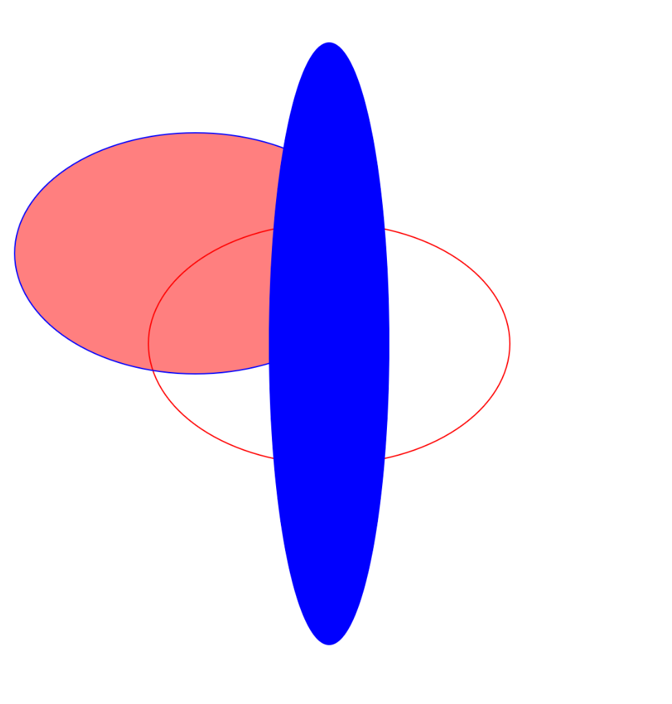
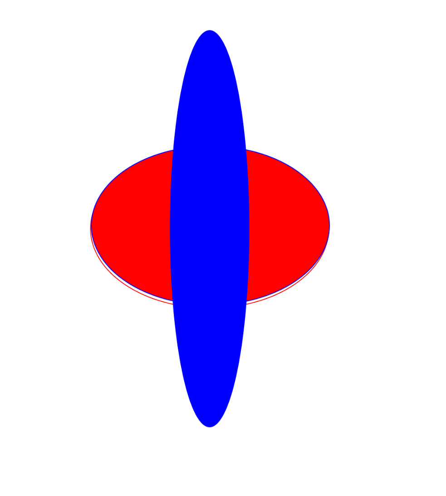
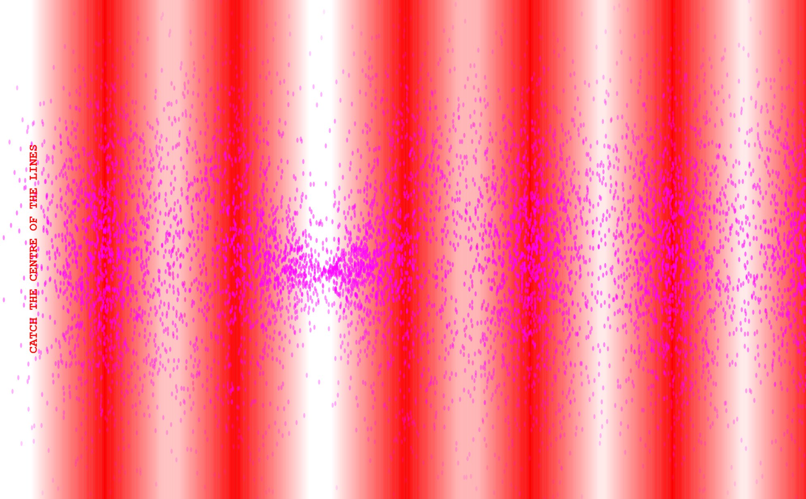

# DOUGLAS P5 workshop

- Today, I am re-learning p5.js. 
- It is a library that makes creative coding easy. 
- I learn that: creative coders are not only the real, badass coders that write the library, but anyone who fucks around with the library. All the people between art and code, between digital interactions and worldy playful ones. Making people drem by creating the impossible visible, tangible, even if it is only digital. 
- In a way, all coding is creative as it generates something from nothing, or from something. 
- Anyway, I should read DESIGN BY NUMBERS by John Maeda. 
- I also learn that python environments translate to vscode profiles, and that I should start being tidier when managing the coding extensions of various coding projects. 
How much I do not miss environments crashes, version updating, error debugging.

In the morning, I made a game where an ellipse needed to be put into another ellipse. 

|  |  |
|:---------------------:|:-----------------:|

In the afternoon, I went deeper and I made a game of the impossible, where dots get attracted to the mouse, and lines get repelled by it. I love magnets. there is no magnetic monopole which still has been discovered. We have positive negative, hot cold, love hate, nord sud.. all can be found as a standalone, but not magnets. 

I learnt a bit more about
- calculating distances, and therefore the coordinates on the canvas display. 
- how p5 thinks colors, opacities, hues. 
- that the draw function is called every second, 60frames/s. 

