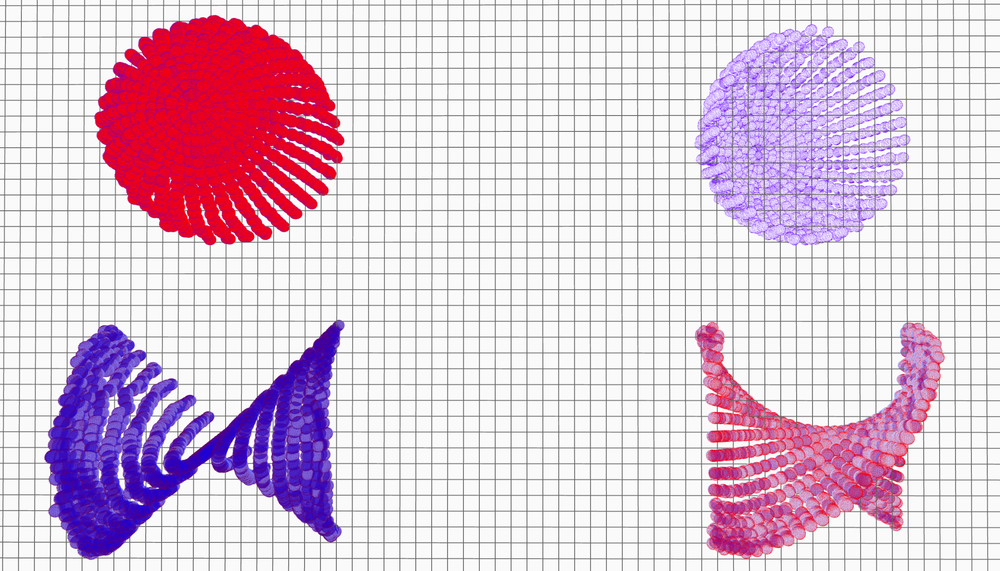
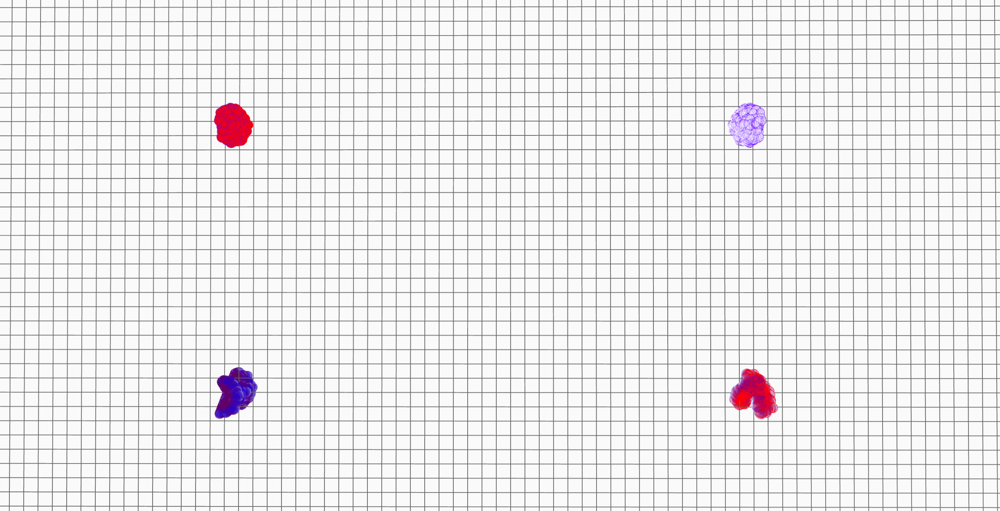
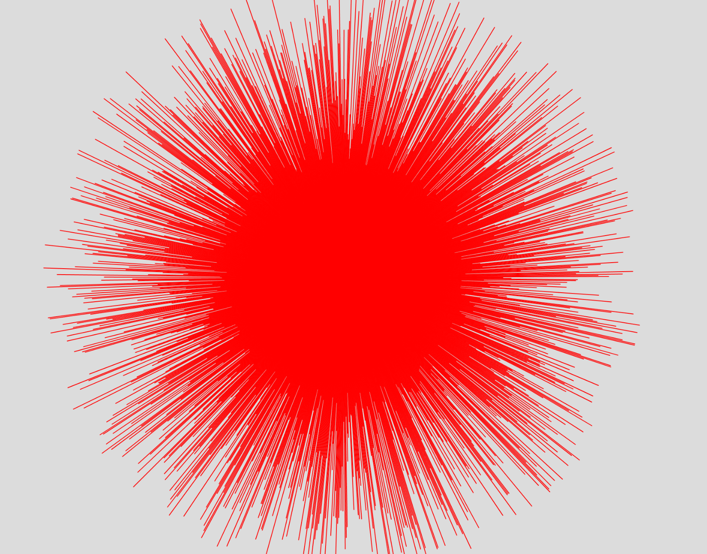
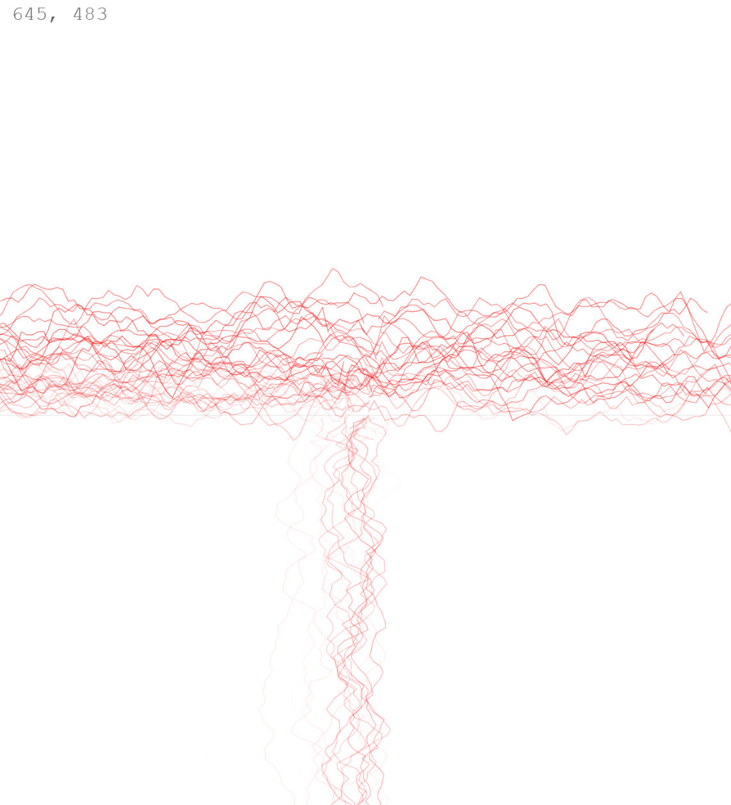
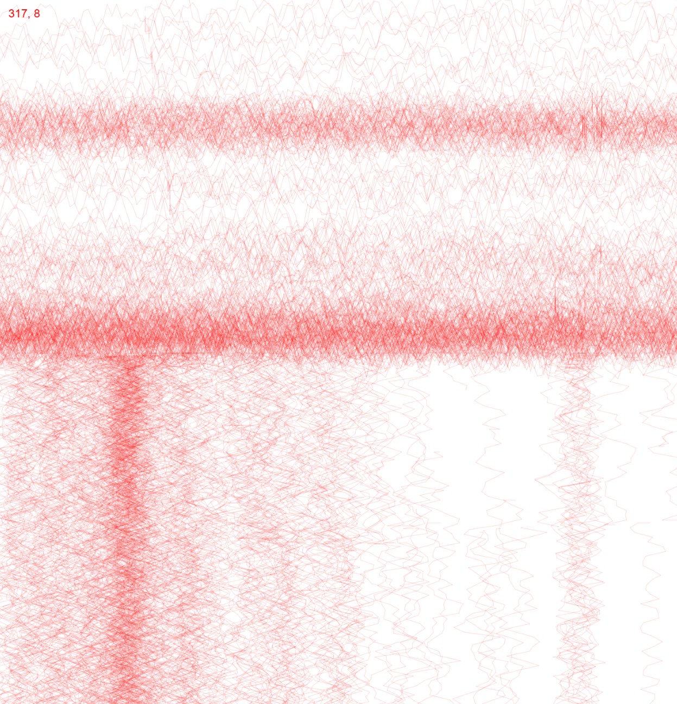

# DAY2

- difference between working in 2D and 3D. 
- create classes in separate files!
- variables always need to initialised!
- how to make stuff with arrays
what happens if we multiply sin and cos in 3d geometry? 

|  |  |
|:---------------------:|:-----------------:|

|  |  | |
|:---------------------:|:-----------------:|:-----------------:|