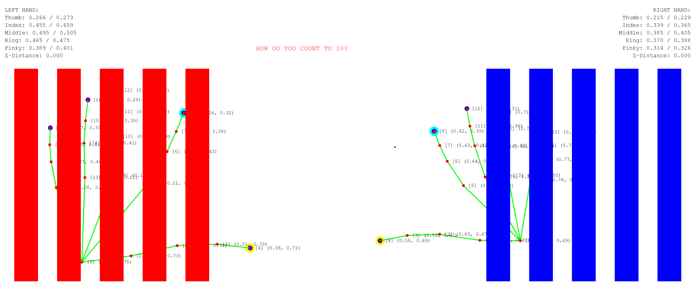
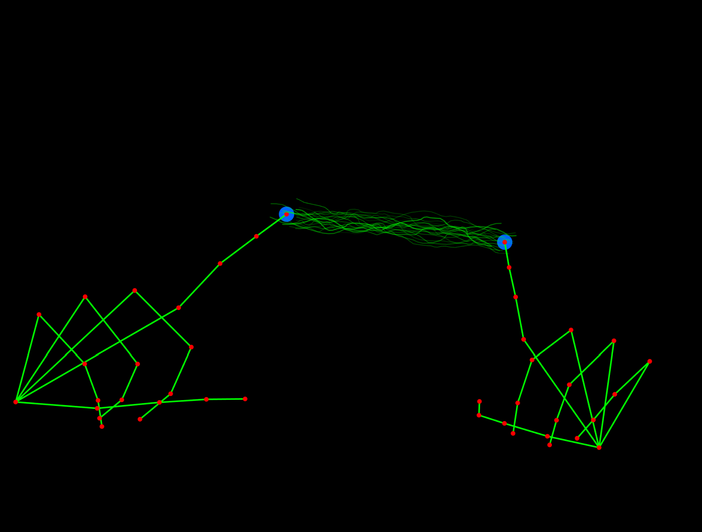
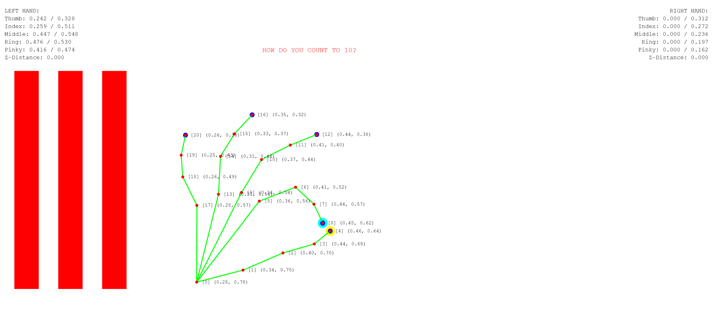
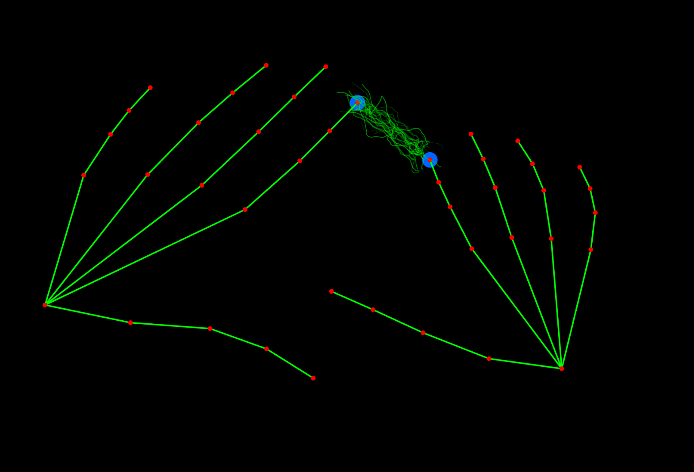

# Hand detection
Today's class will be focused on using everything we learned to (finally!) start playing with body tracking. THE BEST WAY TO KEEP AN INTERACTION GOING. For now, we only have a one or two hand finger-tracking helper. By Thursday we should be able to have other helpers ready for you to explore (face, body). Or you can try any one of the other [Media Pipe Solutions](https://ai.google.dev/edge/mediapipe/solutions/guide) on your own, using our helper and/or the bots as your guide.

There is a new “helper” script that simplifies using the Google [Media Pipe Hands Landmark API](https://ai.google.dev/edge/mediapipe/solutions/vision/hand_landmarker).

You can download the `Hands` demo as a complete folder here:
- [MediaPipe Hands + P5.js Demo](https://github.com/abstractmachine/head-md-oracle-of-suits/releases/latest)

Download the [Hands demo release](https://github.com/abstractmachine/head-md-oracle-of-suits/releases/latest) as a downloadable folder, rename this folder to whatever name you want, and place it in your daily folder.

# Comments

- It is interesting to use hands for what they are actually used for, and not for mouse-like functionalities: therefore, the counting. 
- I calculated distances from wrist to end of fingers and reinitialized it for each person. Nicolas told me that maybe the number of fingers is already embedded in the library, to be checked. 
- fingers detection was very easy. 
- adding sound failed in the beginning, as i tried directly strudel. therefore the folder is work in progress. 

|  |  |
|:---------------------:|:-----------------:|

|  |  |
|:---------------------:|:-----------------:|
