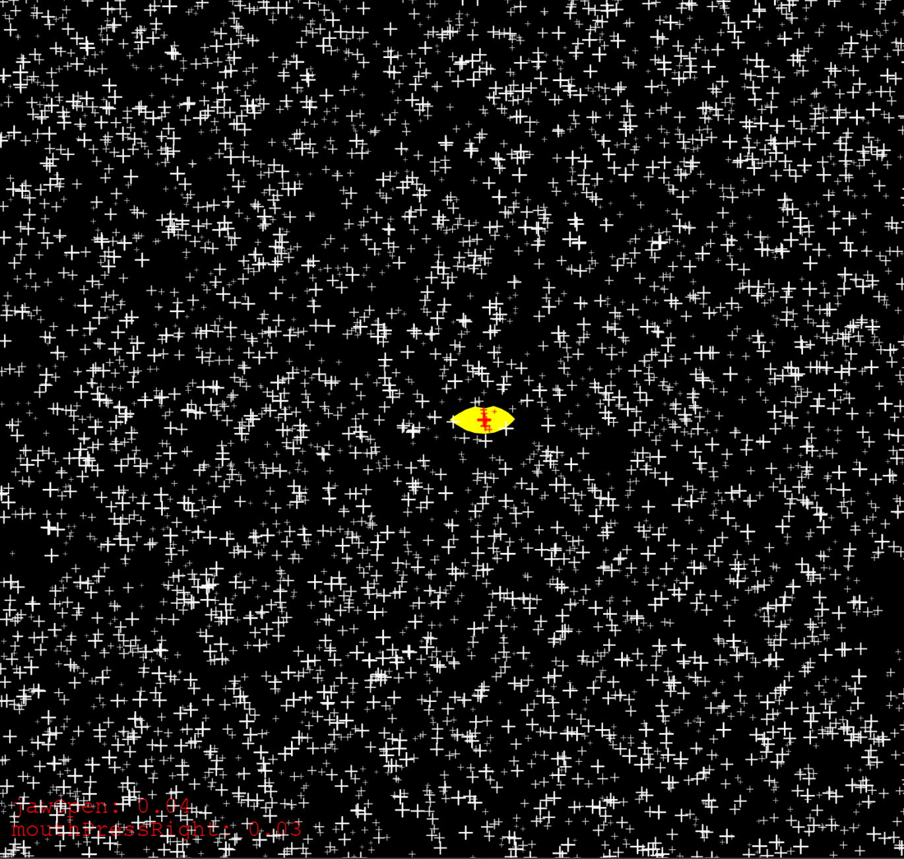
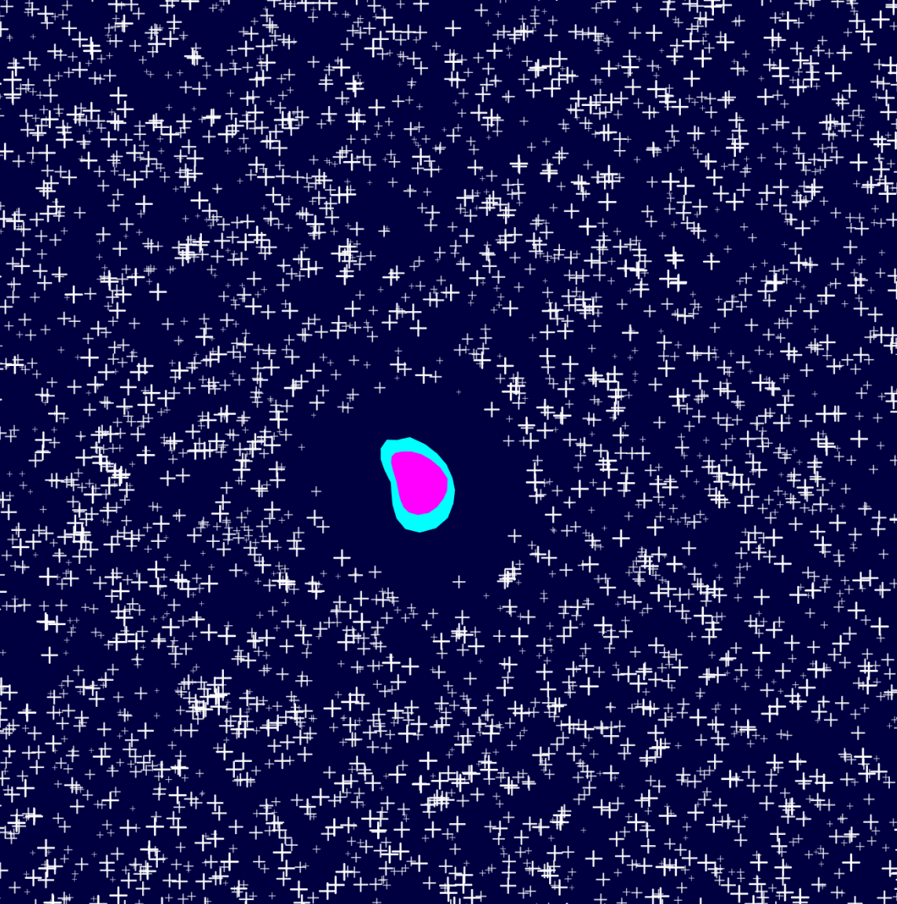
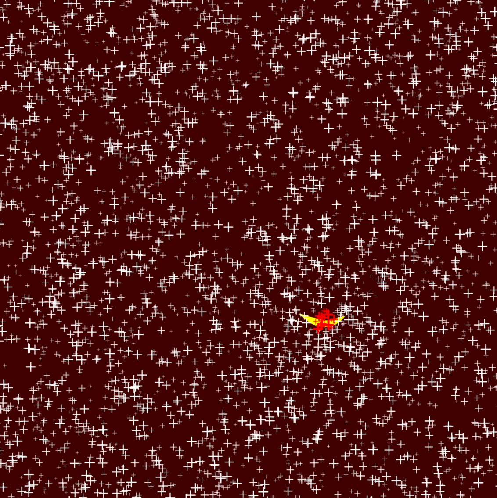

# Experimenting with sound and face detection in p5.js

- Today we went onto inventing playful interactions using our faces. The MediaPipe face landmarks detects even the smallest movement of the face.

- As with the hands, when the interaction beecomes interesting when we use hands for something that we relate to them (or something totally opposite!), I thought about making little noises around the house, which I always do while cooking, showering, thinking. 
What if these could digital? little mouth movements make different sounds. 
Also, sound is invisible. I tried to make it visible by chaning the density of things that could be in the air. 

- Yesterday I struggled to integrate Gibberish.js into my p5.js example. I started with strudel, then asked CHATGPT about some useful and easier sound assistants. With Gibberish you can create real time sound modulations, and not just digital oscillators like in p5.js. There is a whole fascinating universe to explore. I also found a ready made [integration example of gibber into p5](https://editor.p5js.org/charlieroberts/collections/7LFl5Uqrg). Thanks  Charlier Roberts, whoever you are. However, it didn't work, I do not understand where the problem relies, it is not as easy as importing his [release](https://cdn.jsdelivr.net/gh/charlieroberts/p5.gibber.js@latest/dist/p5.gibber.min.js). Furthermore, it is always tricky to start the sound on the browser, it needs a click to be launched. I am now looking at the solution that Douglas found, which could work nicely. 

- The good thing about face and hand interaction is the CONTINUITY of it. 

|  |  |
|:---------------------:|:-----------------:|

|  |  |
|:---------------------:|:-----------------:|
