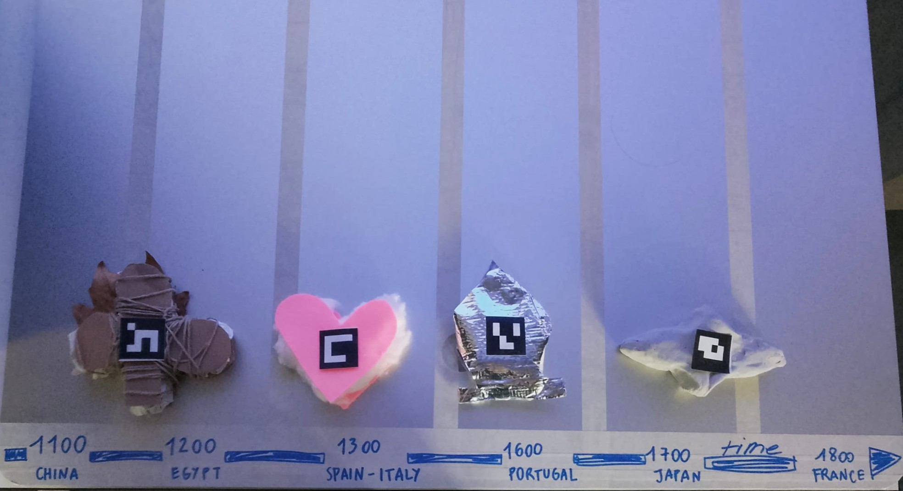
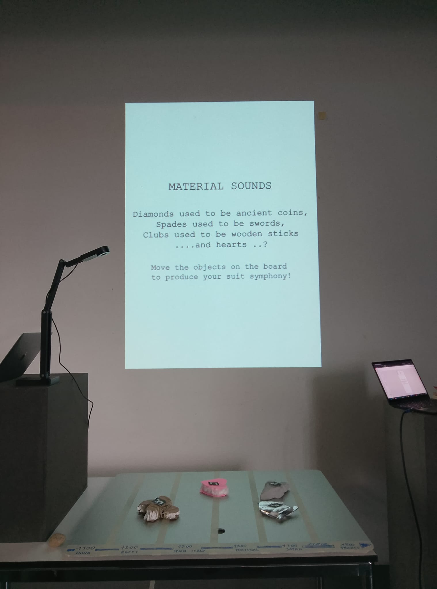

# PROTOTYPE TEST IN CLASS

## INSTALLATION

We had QR code on materials, moving (attached with a magnet, normally) freeing on a metallic board. A camera was tracking their movement and changing the frequency.

A screen was displaying the evolution of suits through historical times on a screen placed above the board. 

## INSIGHTS

- the testers did not slide the objects, but rather placed them on the board, defeating the point of changing/sliding notes to play like a piano through history. 
- the interations were slow and therefore no "melody" was being played, but rather static long sounds. for the next editions, make more "staccato". 
- between material/atmospheric sounds and instruments/notes sounds, they were split in 0.5 preferences, adding notes to atmospheric sounds (and not just changing the frequency) would be the best outcome. 
- the materials did not evoke much, they are just nice, but better if they were suit symbols and not just "blobs"
- the movement along the y axis needs to do something in sound and visuals as well, for now there is only the relationship to the x axis. 
- better onboarding may be necessary. no sentences needed.
 