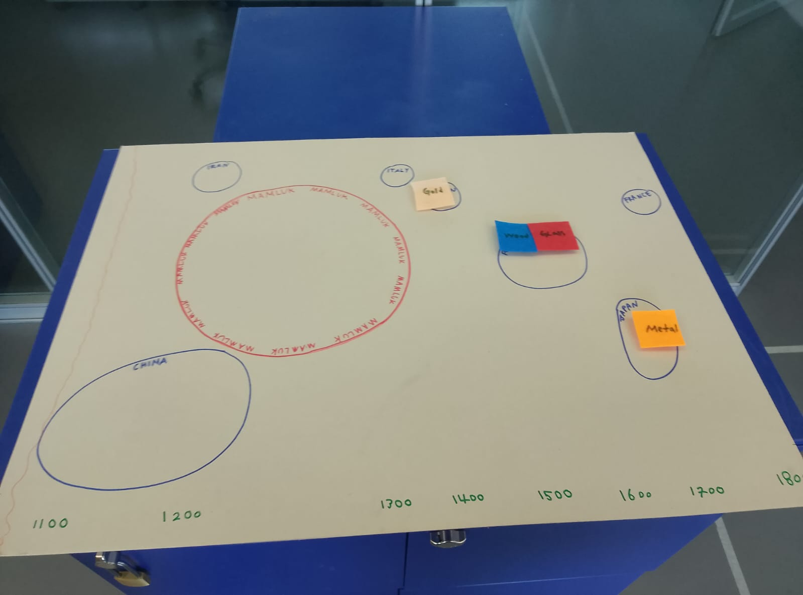
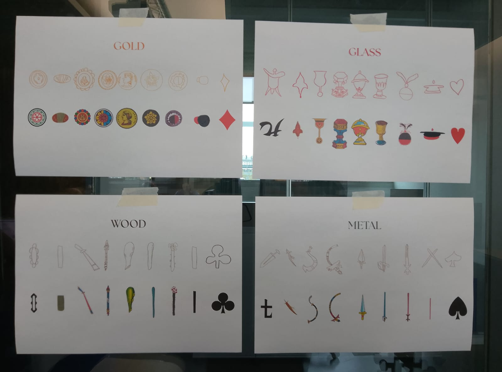
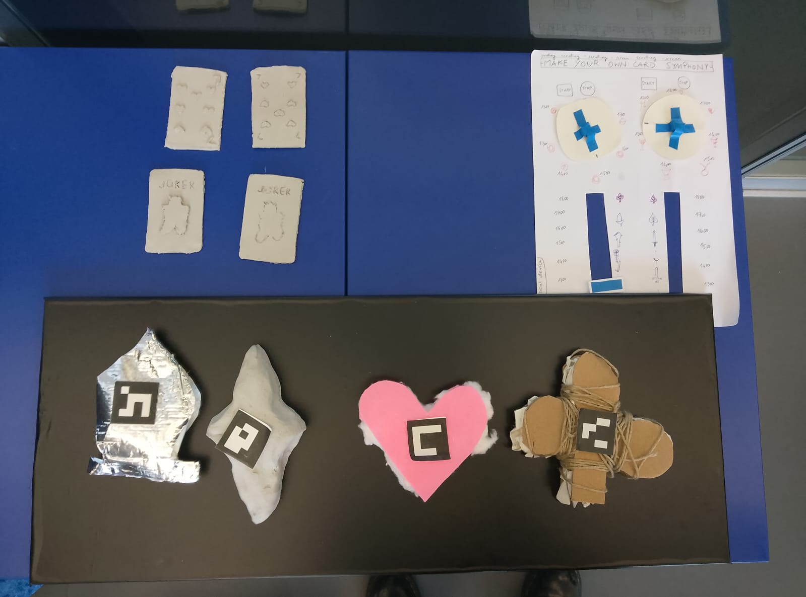

# TEST2 IN CLASS with musee du jeux 

## INSTALLATION

- After discussing with Anne, we decided to keep the 4 materials in RAW shapes, and not as suits. 
- We decided to use MAGNETS to have the sliding functionality. 
- We DREW A MAP of the world on a cardboard, with round shapes representing regions. 
- We kep the timeline at the bottom of the board. 
- We introduced the storytelling/user journey side to our experience. 
- We used AMBIENT SOUNDS instead of melodies. 
- We DRAW the elements to have a consistent design throughout centuries. 

- We also showed what didnt work very well in the past. 

## INSIGHTS/COMMENTS

- make the countries spread horizontalli.spaghetti map!
- treasure hunt to accompany the user!
- ambient music overlap when more materials are placed on board. 
 