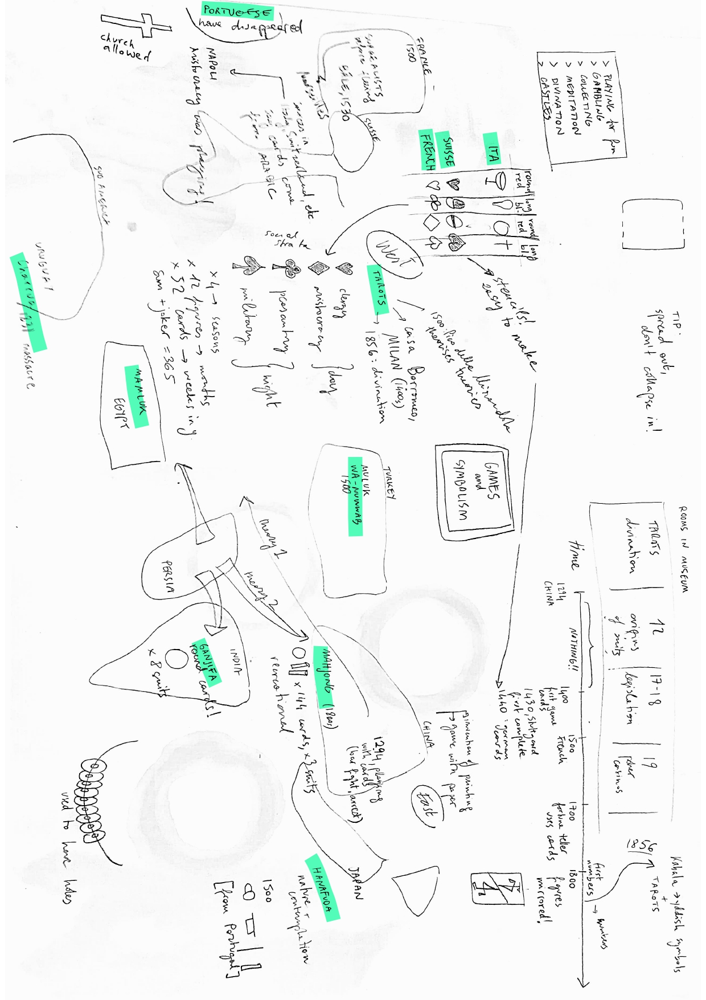
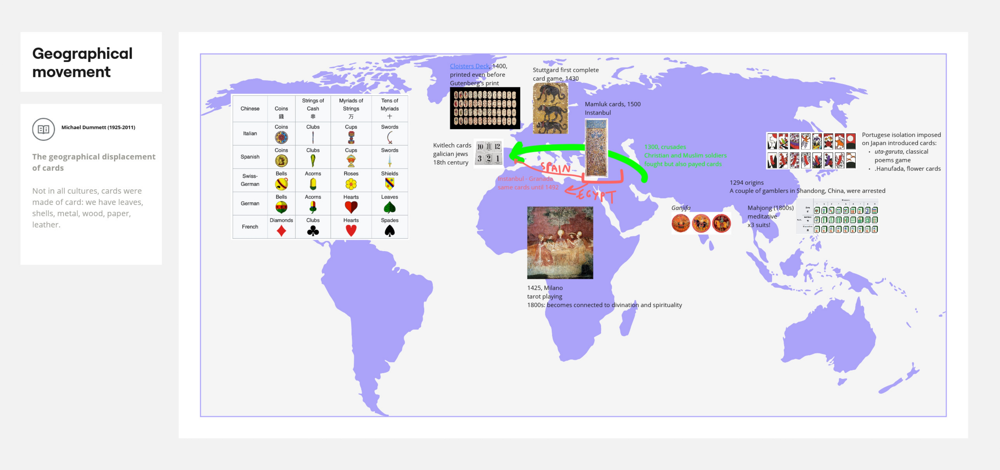
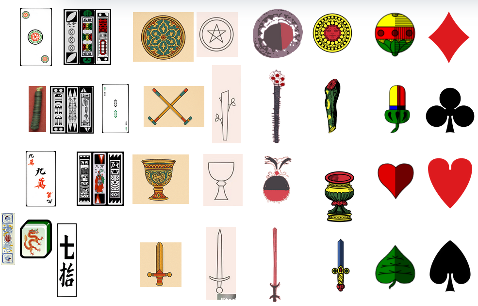
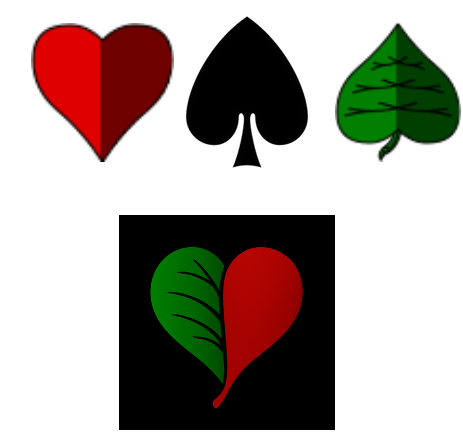
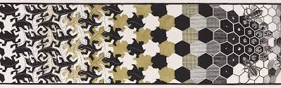
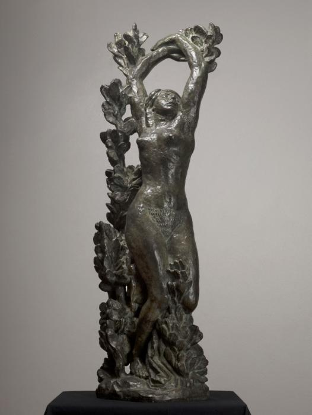
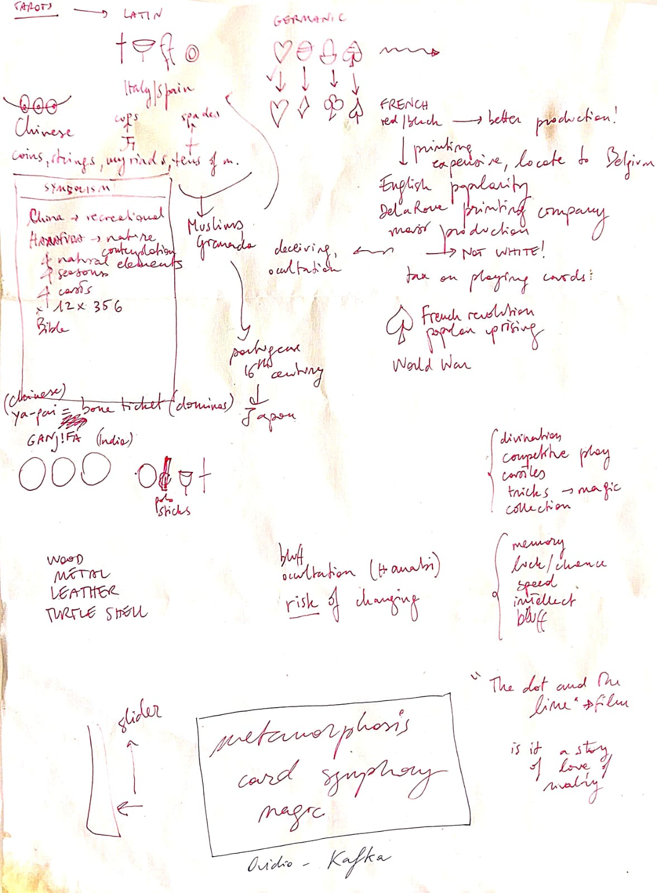
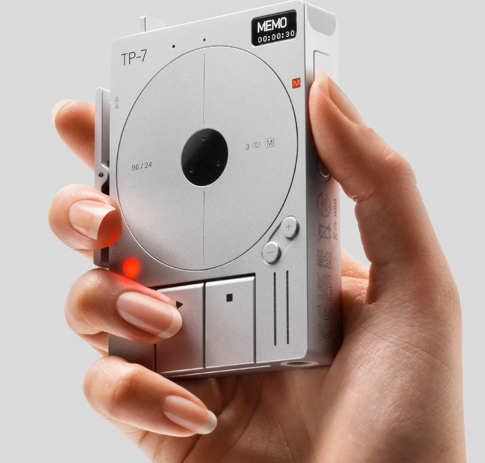
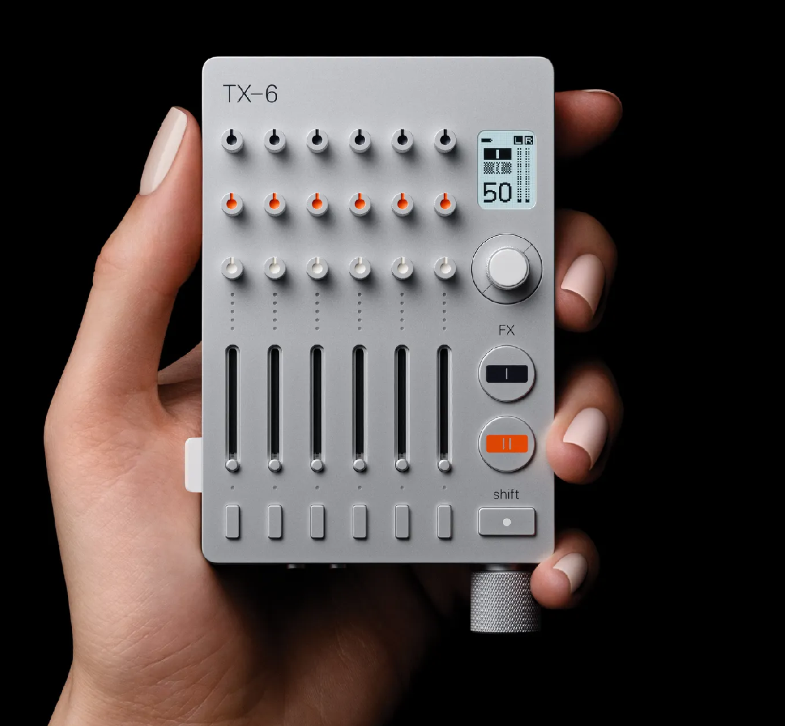
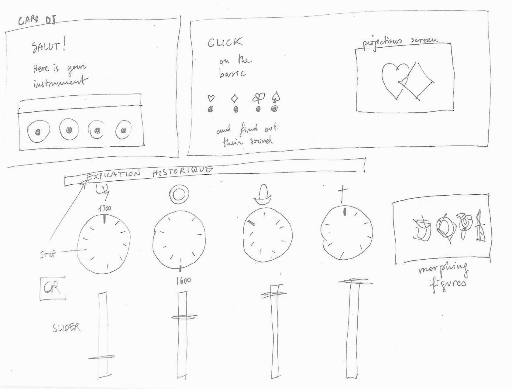

# SUIT SYMPHONY

## Research

Exploring with sound the concept of metamorphosis in card suits throughout centuries. 

- Why do we have 4 modern card suits? Not all cultures of the past only had 4. They had usually more. However, the symbolism of the 4 French suits can be traced back to ancient times. By looking at the geographical displacement of the game of cards, we can learn a lot about their origins. 

 
Before cards, people used to play with coins and bring them around through threads. 

The Chinese coin stick evolved into the polo stick in the Mamluk Anatolian suits. 

The Arabs arrived in Granada, where poeple (not playing polo anymore) transformed it into wooden stick. 

The Germans later simplified it into an acor. 

The French went even further and decided for a unicolor version of it, the clubs. 

My database now includes Chinese, Mamluk, Japanese, Tarots, Latin, German and French symbols. 

The morphing of one symbol into the other can be encapsulated with one term: METAMORPHOSIS.

 

 

- by looking at gestures, imediately I thought about recording SOUND. The idea evolved into what sounds the symbols evocated. I decided to work with sound but later evolved into evocation of sound through symbols. I have asked my HEAD colleagues to look at some images of suits and asked them to produce a sound. I realise that, while I associate specific sounds and frequencies to the material that an object is made of, someone might have a compeltely different outlook. 

    - a heart. I think about heartbeat. they think about cute. 
    - a cup. I think about sip. they think about metal. 
    - a sward. i think about metallic knife. they think about pain. 
Teenage engineering products can be insiping to imagine a game that allows people to DJ THEIR CARD SYMPHONY. 

- My research in the CERN Science Gateway museum (which has a lot of interactive games), I saw how kids were excited about exhibitions that emited sound. The sound jukebox also allows more than one kid at the time to play, which is fun. 

## SUIT SYMPHONY

An interactive audiovisual installation uncovering what symbols hide behind symbols. Hearts, spades, clubs, and diamonds trace back to older symbols that changed across cultures and centuries. Through shifting visuals and evocative sounds, visitors experience the metamorphosis of suits and reveal the secrets of the suits we play with today. 

## Keyword
Metamorphosis. 

## User Journey 

## Novel Combination

- slide/spin
- evocative sound
- symbols

[Here](https://editor.p5js.org/egazzarr/sketches/TYmuqT4Tf) is a simple p5.js prototype. 
